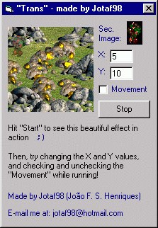

## Translucency for Games

### Description

What this function does is paint a picture to another one, but with a nice translucency effect! Very cool if you want a small, quick function to use translucency in your games -- something that only the top games you buy had!
 
### More Info
 
All you'll input is the image that will be drawn and where, its position and the height/width of the first image (basically you'll put here the ScaleHeight/ScaleWidth of the form or picturebox you'll draw to).

To use, just add the .bas file and call the function.

If you use this function in large or many images at the same time, it may slow down the game, because of the huge calculations involved.

             |
---                |---
**Submitted On**   |2000-07-15 21:54:46
**By**             |[Jotaf98](https://github.com/Planet-Source-Code/PSCIndex/blob/master/ByAuthor/jotaf98.md)
**Level**          |Intermediate
**User Rating**    |4.4 (31 globes from 7 users)
**Compatibility**  |VB 3\.0, VB 4\.0 \(16\-bit\), VB 4\.0 \(32\-bit\), VB 5\.0, VB 6\.0, VB Script, ASP \(Active Server Pages\) 
**Category**       |[Graphics](https://github.com/Planet-Source-Code/PSCIndex/blob/master/ByCategory/graphics__1-46.md)
**World**          |[Visual Basic](https://github.com/Planet-Source-Code/PSCIndex/blob/master/ByWorld/visual-basic.md)
**Archive File**   |[CODE\_UPLOAD78227152000\.zip](https://github.com/Planet-Source-Code/jotaf98-translucency-for-games__1-9793/archive/master.zip)

